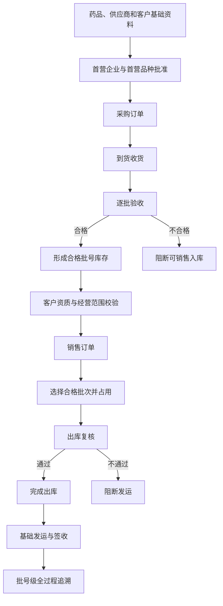
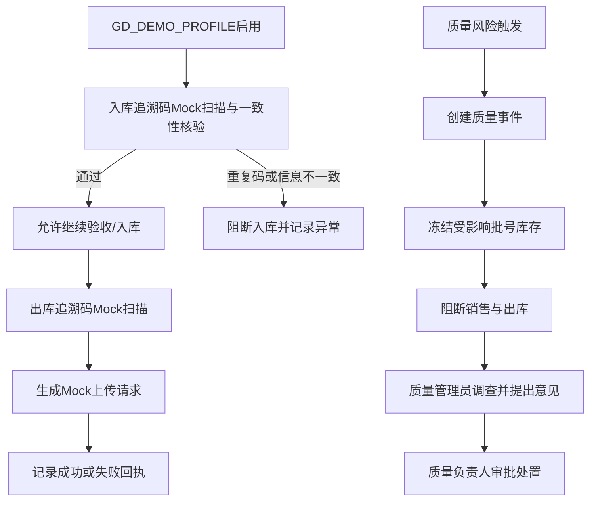

# 药品批发 ERP Demo 业务流程说明（BUSINESS_FLOW）

> **核心定位：** 本文档定义 `pharma-erp-demo` 首版 Demo 的业务执行顺序、岗位交接、阻断条件、业务结果和证据要求。

| 文档属性     | 内容                                                     |
| ------------ | -------------------------------------------------------- |
| 文档版本     | v1.0                                                     |
| 文档状态     | 冻结基线                                                 |
| 最后更新     | 2026-07-23                                               |
| 适用项目     | `pharma-erp-demo`                                      |
| 上位范围文件 | `docs/DEMO_SCOPE.md` v1.1                              |
| 长期工程规则 | 根目录`AGENTS.md`                                      |
| 本文档职责   | 说明业务怎么走，不冻结代码、接口、数据库表名或状态代码值 |

> **优先级声明：** 如本文档与已冻结的 `docs/DEMO_SCOPE.md` 冲突，以 `DEMO_SCOPE.md` 为准；如业务事实仍不明确，应标记为“待后续文档确认”，不得由 AI 自行补充重大规则。

## 关键词约定

| 关键词                   | 含义                                                         |
| ------------------------ | ------------------------------------------------------------ |
| **必须**           | 首版对应里程碑必须实现并纳入验收。                           |
| **阻断**           | 条件不满足时，系统不得继续进入下一业务步骤。                 |
| **业务记录**       | 业务过程中形成并需要查询、追溯的记录。                       |
| **审计证据**       | 能说明谁在何时基于什么原因执行了什么操作的证据。             |
| **待状态机确认**   | 后续由`BUSINESS_STATE_MACHINE.md` 冻结状态名称和转换规则。 |
| **待权限矩阵确认** | 后续由`ROLE_PERMISSION_MATRIX.md` 冻结角色与操作权限。     |
| **待数据设计确认** | 后续由`DATABASE_DESIGN_DEMO.md` 冻结数据结构和约束。       |
| **Mock**           | 使用模拟请求、模拟回执或模拟外部数据，不连接真实监管平台。   |

## 目录

1. [文档目的与边界](#section-1)
2. [参与角色](#section-2)
3. [总体业务闭环](#section-3)
4. [全过程通用控制](#section-4)
5. [里程碑与流程索引](#section-5)
6. [M1：全国核心业务流程](#section-6)
7. [M1 基础衔接与 M2：广东增强、质量展示流程](#section-7)
8. [M3：演示加固流程](#section-8)
9. [流程与验收项映射](#section-9)
10. [后续文档待确认事项](#section-10)
11. [范围外事项](#section-11)
12. [依据与声明](#section-12)

---

## 1. 文档目的与边界

### 1.1 文档目的

本文档用于回答以下问题：

1. 一项业务由谁发起；
2. 开始前必须满足哪些条件；
3. 业务按什么顺序执行；
4. 每一步由什么岗位承接；
5. 哪些情况必须阻断；
6. 正常完成后形成什么业务结果；
7. 应形成哪些业务记录和审计证据；
8. 下一业务流程如何接续。

### 1.2 本文档不负责

本文档不冻结以下内容：

- 数据库表名、字段名和索引；
- Java 类名、包名、接口地址和请求结构；
- 状态枚举的代码值；
- 完整角色权限矩阵；
- 前端页面布局；
- 通用规则引擎；
- 真实广东监管或追溯平台接口；
- `DEMO_SCOPE.md` 明确排除的业务。

### 1.3 业务范围摘要

首版业务范围基于以下企业画像：

- 单法人；
- 单一经营主体；
- 单一自营仓库；
- 普通药品批发；
- 使用演示数据；
- 全国核心流程真实实现；
- 广东追溯和监管能力使用 `GD_DEMO_PROFILE` + Mock 展示。

---

## 2. 参与角色

本节仅说明各角色在流程中的主要职责，不替代后续权限矩阵。

| 角色       | 在本文档中的主要职责                                               |
| ---------- | ------------------------------------------------------------------ |
| 系统管理员 | 维护演示用户、角色、基础配置和演示环境；不代替业务岗位作质量决定。 |
| 采购员     | 建立或补充采购相关基础资料、提交首营申请、创建采购订单。           |
| 收货员     | 核对到货、运输和随货信息，形成收货记录。                           |
| 验收员     | 根据收货记录逐批验收，记录合格或不合格结论。                       |
| 质量管理员 | 审核首营和客户资质资料，调查质量事件并提出处置意见。               |
| 质量负责人 | 对首营企业、首营品种作最终批准，对重大质量处置作审批。             |
| 仓库管理员 | 管理库位、批号库存、库存操作和出库交接。                           |
| 销售员     | 维护销售订单，执行客户准入校验，申请分配可销售批次。               |
| 出库复核员 | 独立复核出库药品、批号、有效期、数量和质量状态。                   |

> 真实企业岗位能否兼任，需要结合企业组织机构、人员资质和质量管理制度另行确认；Demo 采用较清晰的角色分离，用于展示不相容职责和权限控制。

---

## 3. 总体业务闭环

### 3.1 全国核心闭环

### 3.2 广东增强与质量展示

### 3.3 演示加固闭环

---

## 4. 全过程通用控制

以下控制贯穿 BF-01 至 BF-18，而不是单独位于某一个流程末尾。

### 4.1 权限控制

- 业务操作必须以可识别的演示用户身份执行；
- 前端隐藏按钮不能代替后端权限校验；
- 采购、收货、验收、质量批准和出库复核应体现岗位分离；
- 无权限操作必须被阻断并保留失败证据。

### 4.2 审计控制

关键操作至少应能够说明：

- 操作人；
- 操作时间；
- 操作类型；
- 业务对象；
- 操作原因；
- 修改前数据；
- 修改后数据；
- 关联业务编号；
- 操作结果。

### 4.3 数据完整性控制

- 不得通过直接修改总库存数量绕过库存流水；
- 关键业务记录不得无痕删除或覆盖；
- 业务来源、业务结果和后续去向必须能够关联；
- Mock 外部交互必须明确标记为 Mock，不得伪装成真实平台回执。

### 4.4 效期和质量状态控制

- 待验、冻结、不合格和过期库存不得销售和出库；
- 近效期应按照药品档案的管理规则产生预警；
- 质量状态变化必须说明原因并形成审计证据；
- 完整召回、销毁和 CAPA 不属于首版范围。

### 4.5 追溯控制

- 全国核心至少实现批号级追溯；
- `CODE_ENABLED` 模式在批号级追溯基础上增加追溯码 Mock 流程；
- 追溯查询不得仅显示汇总结果，应能够跳转或定位到来源业务记录；
- 追溯记录不得因业务记录归档或状态变化而断链。

---

## 5. 里程碑与流程索引

| 流程编号 | 流程名称                         | 里程碑                   | 主要验收关联        |
| -------- | -------------------------------- | ------------------------ | ------------------- |
| BF-01    | 药品档案建立与启用前准备         | M1                       | AC-01、AC-08        |
| BF-02    | 首营企业申请、审核与批准         | M1                       | AC-01、AC-08        |
| BF-03    | 首营品种申请、审核与批准         | M1                       | AC-01、AC-08        |
| BF-04    | 客户资质审核与动态校验           | M1                       | AC-01、AC-08        |
| BF-05    | 采购订单创建与确认               | M1                       | AC-01               |
| BF-06    | 到货收货与随货信息核对           | M1                       | AC-01               |
| BF-07    | 验收员逐批验收                   | M1                       | AC-01、AC-02        |
| BF-08    | 验收合格后形成批号库存           | M1                       | AC-01、AC-02、AC-09 |
| BF-09    | 库存数量变化与库存流水           | M1                       | AC-02、AC-09        |
| BF-10    | 销售订单与客户准入校验           | M1                       | AC-01、AC-08        |
| BF-11    | 合格批次选择与库存占用           | M1                       | AC-01、AC-02、AC-09 |
| BF-12    | 出库复核与完成出库               | M1                       | AC-01、AC-02、AC-03 |
| BF-13    | 批号级全过程追溯                 | M1；M2扩展质量与码级节点 | AC-06               |
| BF-14    | 简化发运与签收                   | M1基础；M2增强           | AC-01、AC-11        |
| BF-15    | 质量事件、库存冻结与质量处置     | M2                       | AC-02、AC-10        |
| BF-16    | 广东追溯码入库、出库和 Mock 上传 | M2                       | AC-07               |
| BF-17    | 演示数据初始化与重置             | M3                       | AC-05               |
| BF-18    | 演示数据库备份与恢复验证         | M3                       | AC-12               |

---

## 6. M1：全国核心业务流程

### BF-01 药品档案建立与启用前准备

| 项目     | 内容                                                                                                 |
| -------- | ---------------------------------------------------------------------------------------------------- |
| 业务目的 | 建立可供首营品种审核和后续经营流程引用的药品基础资料。                                               |
| 参与角色 | 采购员或基础资料维护人员、质量管理员。                                                               |
| 前置条件 | 当前药品尚未进入可采购状态；用户具有相应资料维护权限。                                               |
| 输入资料 | 药品名称、通用名称、剂型、规格、批准文号、生产企业、储存条件、效期管理规则、追溯管理模式及证明资料。 |

#### 主流程

1. 采购员或基础资料维护人员发起药品档案建立；
2. 录入药品基本资料和经营所需的质量属性；
3. 上传或登记批准证明、说明资料等演示附件；
4. 系统校验必填内容、格式和有效性；
5. 质量管理员检查资料完整性和明显矛盾；
6. 档案进入“可提交首营品种申请”的业务阶段；
7. 档案本身不因建立完成而自动获得采购或销售资格。

#### 异常与阻断

- 必填信息缺失时，阻断提交；
- 批准文号、生产企业、规格或储存条件存在明显矛盾时，转人工核实；
- 疑似重复档案时，提示复核，不得静默生成重复资料；
- 特殊管理药品、疫苗或冷链专项场景超出当前范围时，阻断进入首版经营流程。

#### 正常完成结果

- 形成可被 BF-03 引用的药品档案；
- 药品尚不可采购或销售；
- 可追溯到档案创建人、创建时间和附件来源。

#### 业务记录与审计证据

- 药品档案记录；
- 附件或附件清单；
- 创建与修改记录；
- 资料完整性检查结果；
- 修改原因和前后值。

#### 下一流程

- BF-03 首营品种申请、审核与批准。

#### 待后续文档确认

- **待状态机确认：** 药品档案草稿、待审核、可用、停用等状态及转换条件；
- **待权限矩阵确认：** 谁可创建、修改、停用和提交首营；
- **待数据设计确认：** 药品档案、附件、追溯管理模式和变更记录的结构。

---

### BF-02 首营企业申请、审核与批准

| 项目     | 内容                                                                               |
| -------- | ---------------------------------------------------------------------------------- |
| 业务目的 | 在首次与供应商发生业务关系前，对供应商合法资格、经营范围和资质有效性进行审核批准。 |
| 参与角色 | 采购员、质量管理员、质量负责人。                                                   |
| 前置条件 | 供应商基础资料已建立；演示资质文件已准备；尚未获得有效首营企业批准。               |
| 输入资料 | 企业证照、许可证、经营或生产范围、有效期、联系人及质量保证相关资料。               |

#### 主流程

1. 采购员选择供应商并提交首营企业申请；
2. 系统检查资料是否齐全、是否在有效期内；
3. 质量管理员审核企业合法资格、许可范围和资料一致性；
4. 发现需要补充的资料时，退回申请并说明原因；
5. 质量管理员审核通过后，提交质量负责人批准；
6. 质量负责人批准或驳回；
7. 批准后，供应商获得在有效范围和有效期内参与采购的资格；
8. 后续采购仍需校验供应商资质是否持续有效。

#### 异常与阻断

- 许可证过期、冻结或无效时，阻断批准；
- 经营或生产范围不覆盖拟采购药品时，阻断相关采购；
- 资料之间存在企业名称、统一标识或许可信息不一致时，转人工核实；
- 质量管理员不得代替质量负责人作最终批准；
- 采购员不得审核或批准自己提交的首营申请。

#### 正常完成结果

- 形成有效或被驳回的首营企业结论；
- 有效批准允许供应商进入 BF-05 采购订单校验；
- 批准仅在资质有效期和许可范围内有效。

#### 业务记录与审计证据

- 首营企业申请；
- 资质审核清单；
- 补充资料和退回意见；
- 质量管理员审核意见；
- 质量负责人批准或驳回意见；
- 申请人、审核人、批准人和各环节时间。

#### 下一流程

- BF-03 首营品种申请、审核与批准；
- BF-05 采购订单创建与确认。

#### 待后续文档确认

- **待状态机确认：** 草稿、待审核、待批准、通过、驳回、失效等状态；
- **待权限矩阵确认：** 申请、审核、批准、撤回和补充资料权限；
- **待数据设计确认：** 供应商资质、首营申请和审核批准记录的关联方式。

---

### BF-03 首营品种申请、审核与批准

| 项目     | 内容                                                                                     |
| -------- | ---------------------------------------------------------------------------------------- |
| 业务目的 | 在首次采购某药品前，确认药品合法性、资料完整性和拟供货来源是否符合当前 Demo 的经营边界。 |
| 参与角色 | 采购员、质量管理员、质量负责人。                                                         |
| 前置条件 | BF-01 药品档案已建立；BF-02 供应商首营企业已批准且资质有效。                             |
| 输入资料 | 药品档案、批准证明、生产企业资料、储存条件、拟供货单位和相关证明资料。                   |

#### 主流程

1. 采购员选择药品和拟供货单位，提交首营品种申请；
2. 系统校验药品档案完整性和供应商有效性；
3. 质量管理员审核药品批准信息、生产企业、剂型、规格、储存条件等资料；
4. 质量管理员确认拟供货单位的经营或生产范围覆盖该药品；
5. 资料有缺口时，退回申请补充；
6. 质量管理员审核通过后，提交质量负责人批准；
7. 质量负责人批准或驳回；
8. 批准后，该药品在已确认的业务关系和范围内允许进入采购流程。

#### 异常与阻断

- 药品档案不完整或被停用时，阻断申请；
- 批准信息无法核验或资料明显矛盾时，阻断批准；
- 供应商资质失效或范围不匹配时，阻断批准或采购；
- 首营品种未批准时，BF-05 不得创建有效采购订单。

#### 正常完成结果

- 形成首营品种批准或驳回结论；
- 通过后，药品具备进入采购校验的业务资格；
- 仍需在采购时重新校验供应商和药品当前有效状态。

#### 业务记录与审计证据

- 首营品种申请；
- 药品合法性和资料审核清单；
- 拟供货单位关联；
- 审核、批准或驳回意见；
- 申请、审核、批准时间和人员；
- 后续关键资料变更记录。

#### 下一流程

- BF-05 采购订单创建与确认。

#### 待后续文档确认

- **待状态机确认：** 首营品种状态及关键资料变更后的重审路径；
- **待权限矩阵确认：** 谁可申请、审核、批准及查看资料；
- **待数据设计确认：** 首营品种是按药品、按药品与供应商组合，还是采用其他关联方式。

---

### BF-04 客户资质审核与动态校验

| 项目     | 内容                                                                         |
| -------- | ---------------------------------------------------------------------------- |
| 业务目的 | 确认购货单位合法资格、适用范围和相关人员信息，确保销售对象符合业务准入要求。 |
| 参与角色 | 销售员、质量管理员。                                                         |
| 前置条件 | 客户基础资料已建立；资质和经营或使用范围资料已准备。                         |
| 输入资料 | 客户证照、许可或使用资质、适用范围、有效期、采购人员或提货人员信息。         |

#### 主流程

1. 销售员或资料维护人员提交客户资质资料；
2. 质量管理员审核客户合法资格、有效期和适用范围；
3. 质量管理员核验采购人员或提货人员信息是否已登记或获得授权；
4. 审核通过后，客户在其有效范围内获得销售准入；
5. 系统在 BF-10 创建或提交销售订单时再次执行动态校验；
6. 客户资质变化、过期或被冻结时，自动影响后续销售资格。

#### 异常与阻断

- 客户资质过期、无效或被冻结时，阻断销售；
- 客户经营、使用或诊疗范围与拟购药品不匹配时，阻断销售；
- 采购人员或提货人员信息不完整时，阻断或转人工确认；
- 销售员不得自行绕过质量审核和动态校验。

#### 正常完成结果

- 客户获得在有效期和适用范围内的销售准入；
- 可被 BF-10 销售订单动态校验引用。

#### 业务记录与审计证据

- 客户资质资料；
- 审核结论和意见；
- 适用范围和有效期；
- 采购人员、提货人员或授权信息；
- 资质状态变化记录；
- 审核人和审核时间。

#### 下一流程

- BF-10 销售订单与客户准入校验。

#### 待后续文档确认

- **待状态机确认：** 客户资质草稿、待审核、有效、失效、冻结等状态；
- **待权限矩阵确认：** 客户资料维护、审核、冻结和恢复权限；
- **待数据设计确认：** 资质范围、人员授权和动态校验结果的存储方式。

---

### BF-05 采购订单创建与确认

| 项目     | 内容                                                                         |
| -------- | ---------------------------------------------------------------------------- |
| 业务目的 | 在已批准的供应商和首营品种范围内形成采购业务指令，为后续收货和验收提供来源。 |
| 参与角色 | 采购员。                                                                     |
| 前置条件 | BF-02 首营企业有效；BF-03 首营品种有效；供应商和药品当前未被停用或限制。     |
| 输入资料 | 供应商、药品、采购数量、约定信息、预计到货信息。                             |

#### 主流程

1. 采购员选择已通过准入的供应商；
2. 选择已通过首营品种批准的药品；
3. 录入采购数量和必要业务信息；
4. 系统校验供应商资质、许可范围、药品状态和首营品种状态；
5. 采购员确认订单；
6. 系统形成可供 BF-06 收货引用的采购订单；
7. **采购订单不能直接增加库存。** 采购订单本身不产生任何库存数量变化。

#### 异常与阻断

- 供应商首营未批准或已失效时，阻断确认；
- 首营品种未批准时，阻断确认；
- 采购药品超出供应商许可范围时，阻断确认；
- 数量无效或关键业务信息缺失时，阻断确认；
- 已进入收货流程的订单核心内容不得无痕修改。

#### 正常完成结果

- 形成已确认的采购订单；
- 订单可被收货员在 BF-06 中引用；
- 不形成批号库存和库存流水。

#### 业务记录与审计证据

- 采购订单及明细；
- 供应商和首营品种校验结果；
- 创建人、确认人和时间；
- 核心数据修改前后值和修改原因。

#### 下一流程

- BF-06 到货收货与随货信息核对。

#### 待后续文档确认

- **待状态机确认：** 采购订单草稿、确认、部分收货、全部收货、关闭等状态；
- **待权限矩阵确认：** 创建、确认、修改和关闭权限；
- **待数据设计确认：** 订单主明细结构和收货数量累计方式。

---

### BF-06 到货收货与随货信息核对

| 项目     | 内容                                                               |
| -------- | ------------------------------------------------------------------ |
| 业务目的 | 将实际到货与采购来源、运输和随货信息进行核对，并形成独立收货记录。 |
| 参与角色 | 收货员。                                                           |
| 前置条件 | 存在可收货的采购订单；货物实际到达；收货员具有收货权限。           |
| 输入资料 | 采购订单、随货同行信息、运输信息、到货药品和包装信息。             |

#### 主流程

1. 收货员选择采购订单并登记到货；
2. 核对供货单位、采购订单和随货信息是否一致；
3. 核对运输方式、运输状态和包装外观；
4. 按实际到货药品和批次拆分收货内容；
5. 登记到货数量、批号、生产日期、有效期至等可在收货时取得的信息；
6. 对数量差异、包装异常或随货信息异常进行标记；
7. 收货完成后，形成待验批次记录，并进入待验区域或待验状态；
8. 待验批次只表示企业已接收但尚未完成质量验收，不属于可销售库存；
9. 通知验收员进入 BF-07 逐批验收；
10. 收货员不得作出最终质量合格结论。

#### 异常与阻断

- 无采购订单来源时，阻断正常收货并转异常处理；
- 供货单位与采购订单不一致时，阻断进入正常验收；
- 随货信息缺失或明显不一致时，转待处理；
- 包装严重破损、污染或无法识别时，阻断正常验收；
- 超过采购数量的处理规则未确认前，不得静默扩大收货数量；
- 收货员不得修改采购订单核心数据或代替验收员作结论。

#### 正常完成结果

- 形成独立的收货记录；
- 每个实际批次形成待验批次记录并进入待验状态；
- 待验批次不属于可销售库存。

#### 业务记录与审计证据

- 收货记录；
- 待验批次记录；
- 采购订单关联；
- 随货信息核对结果；
- 运输方式和包装检查结果；
- 到货数量和差异说明；
- 收货员、收货时间和异常标记。

#### 下一流程

- BF-07 验收员逐批验收。

#### 待后续文档确认

- **待状态机确认：** 待收货、部分收货、已收货、待验、待处理等状态；
- **待权限矩阵确认：** 收货、异常登记和撤销权限；
- **待数据设计确认：** 采购、收货、批次和随货资料的关联方式。

---

### BF-07 验收员逐批验收

| 项目     | 内容                                                                                         |
| -------- | -------------------------------------------------------------------------------------------- |
| 业务目的 | 对实际收货药品按批次进行独立验收，形成合格或不合格结论。                                     |
| 参与角色 | 验收员；异常时由质量管理员介入。                                                             |
| 前置条件 | BF-06 收货记录已完成；药品处于待验收阶段；验收员与收货操作职责分离。                         |
| 输入资料 | 收货记录、采购信息、药品档案、批号、生产日期、有效期至、批准文号、生产企业、包装和随货资料。 |

#### 主流程

1. 验收员选择待验收的收货批次；
2. 核对药品名称、剂型、规格、批准文号和生产企业；
3. 核对批号、生产日期、有效期至和到货数量；
4. 检查包装、标签、说明资料和外观等演示检查项；
5. 记录验收合格数量和不合格数量；
6. 对每个批次分别作出验收结论；
7. 验收合格数量进入 BF-08，由待验状态转为合格批号库存；
8. 验收不合格数量不得转为可销售库存，应保留不合格结论和处置记录；
9. 需要进一步质量判断时，通知质量管理员处理。

#### 异常与阻断

- 批号、有效期、批准信息或生产企业无法确认时，阻断合格结论；
- 药品与采购或收货信息不一致时，阻断合格结论；
- 过期药品不得验收为合格；
- 不合格事项和处置措施未填写时，不得完成不合格结论；
- 验收员不得修改采购订单或首营批准结论；
- `GD_DEMO_PROFILE` 且药品启用码级管理时，还必须通过 BF-16 的入库码级核验。

#### 正常完成结果

- 每个待验批次形成明确验收结论；
- 合格数量可进入 BF-08，由待验状态转为合格库存；
- 不合格数量不进入可销售库存，并保留问题和处置记录。

#### 业务记录与审计证据

- 验收记录；
- 批次、数量和效期信息；
- 验收检查项和结论；
- 不合格事项和处置措施；
- 验收员、验收时间；
- 质量人员介入记录；
- 结论修改前后值、原因和审批痕迹。

#### 下一流程

- 合格：BF-08 验收合格后形成批号库存；
- 异常：BF-15 质量事件、库存冻结与质量处置，或在入库前维持待处理。

#### 待后续文档确认

- **待状态机确认：** 待验收、验收中、合格、不合格、待质量处理等状态；
- **待权限矩阵确认：** 验收、复核结论和质量介入权限；
- **待数据设计确认：** 多批次、多结果和合格/不合格数量的记录结构。

---

### BF-08 验收合格后形成批号库存

| 项目     | 内容                                                                                          |
| -------- | --------------------------------------------------------------------------------------------- |
| 业务目的 | 将待验批次中验收合格的数量转为具有批号、效期、库位和合格质量状态的可销售库存。                |
| 参与角色 | 仓库管理员；系统自动执行部分规则。                                                            |
| 前置条件 | BF-06 已形成待验批次，且 BF-07 已形成合格验收记录；药品未被其他规则限制；存在可用仓库和库位。 |
| 输入资料 | 待验批次、合格验收记录、药品、批号、有效期至、合格数量、仓库和库位信息。                      |

#### 主流程

1. 仓库管理员选择待验批次对应的验收合格记录；
2. 指定或确认仓库和库位；
3. 系统按药品、批号、有效期至、仓库、库位和质量状态识别库存层级；
4. 系统将验收合格数量由待验状态转为对应的合格批号库存；
5. 同时生成首次入库库存流水；
6. 记录来源验收记录和操作人；
7. 计算近效期预警信息；
8. 库存进入可被 BF-11 选择的业务范围。

#### 异常与阻断

- 无合格验收来源时，阻断入库；
- 入库数量超过合格验收数量时，阻断；
- 批号或有效期缺失时，阻断；
- 仓库或库位不可用时，阻断；
- 已过期批次不得形成可销售库存；
- 不得直接修改库存总数代替入库流水。

#### 正常完成结果

- 形成合格批号库存；
- 形成来源明确的首次库存流水；
- 可以参与销售批次选择，但仍受客户、效期、质量状态和数量规则控制。

#### 业务记录与审计证据

- 批号库存记录；
- 首次入库库存流水；
- 验收来源；
- 仓库和库位；
- 入库数量；
- 近效期计算结果；
- 操作人和操作时间。

#### 下一流程

- BF-09 库存数量变化与库存流水；
- BF-11 合格批次选择与库存占用；
- BF-13 批号级全过程追溯。

#### 待后续文档确认

- **待状态机确认：** 从待验到合格库存的具体转换；
- **待权限矩阵确认：** 库位分配、入库确认和异常撤销权限；
- **待数据设计确认：** 批号库存唯一识别维度和库存流水结构。

---

### BF-09 库存数量变化与库存流水

| 项目     | 内容                                                           |
| -------- | -------------------------------------------------------------- |
| 业务目的 | 确保所有库存数量和质量状态变化都有明确来源、前后值和审计证据。 |
| 参与角色 | 仓库管理员、出库复核员、质量管理员、质量负责人；系统自动记录。 |
| 前置条件 | 存在批号库存；发生已批准的业务事件。                           |
| 输入资料 | 入库、出库、占用释放、质量冻结或处置等来源业务记录。           |

#### 主流程

1. 业务流程发起库存变化请求；
2. 系统校验来源业务是否合法、数量是否充足、状态是否允许；
3. 记录变动前数量和质量状态；
4. 执行数量增加、减少、占用、释放或质量状态转换；
5. 记录变动数量、变动后数量和状态；
6. 生成库存流水或质量状态变更记录；
7. 关联来源业务编号、操作人和时间；
8. 将结果提供给销售、追溯和审计查询。

#### 首版允许的主要来源

- BF-08 验收合格入库；
- BF-11 销售批次占用和释放；
- BF-12 完成出库后的库存扣减；
- M1：由质量管理员提出、质量负责人批准的简化库存冻结和解除冻结；
- M2：由 BF-15 质量事件驱动的冻结、调查、审批和最终处置；
- 经范围确认的演示数据重置，不作为真实业务流水。

> M1 只要求能够演示受控冻结、解除冻结及审计留痕。M2 才实现完整的质量事件发起、影响范围查询、调查意见、质量负责人审批和结案流程。

#### 异常与阻断

- 变动后数量为负数时，阻断；
- 来源业务不存在或状态不允许时，阻断；
- 操作人无权限时，阻断；
- 直接手工修改总库存而无来源流水时，阻断；
- 质量状态变化未说明原因或缺少审批时，阻断；
- 并发操作导致版本冲突时，应提示重新加载，不得静默覆盖。

#### 正常完成结果

- 库存数量和质量状态与来源业务一致；
- 所有变化可按批号和业务来源追溯；
- 可支持 BF-13 的完整库存轨迹查询。

#### 业务记录与审计证据

- 库存流水；
- 质量状态变更记录；
- 变动前后数量和状态；
- 变动原因；
- 来源业务；
- 操作人、时间和结果；
- 冲突或失败记录。

#### 下一流程

- BF-11 合格批次选择与库存占用；
- BF-13 批号级全过程追溯；
- M2：BF-15 质量事件处理。

#### 待后续文档确认

- **待状态机确认：** 占用、释放、出库和质量转换的状态规则；
- **待权限矩阵确认：** 哪些角色可触发各类库存变化；
- **待数据设计确认：** 可用、占用、冻结数量及并发控制模型。

---

### BF-10 销售订单与客户准入校验

| 项目     | 内容                                                                       |
| -------- | -------------------------------------------------------------------------- |
| 业务目的 | 在销售发生前动态确认客户合法资格、经营或使用范围以及药品和库存可销售条件。 |
| 参与角色 | 销售员；质量管理员负责客户资质规则。                                       |
| 前置条件 | BF-04 客户资质审核有效；存在有效药品档案和可用库存。                       |
| 输入资料 | 客户、药品、销售数量、销售业务信息、采购或提货人员信息。                   |

#### 主流程

1. 销售员选择客户；
2. 系统动态检查客户资质状态和有效期；
3. 检查客户经营、使用或诊疗范围是否覆盖拟购药品；
4. 检查采购人员或提货人员信息是否有效或已登记；
5. 销售员录入药品和数量；
6. 系统检查药品档案是否有效；
7. 系统检查是否存在满足条件的合格批号库存；
8. 销售员提交订单；
9. 订单进入 BF-11 批次选择与库存占用。

#### 异常与阻断

- 客户资质过期、冻结或无效时，阻断；
- 客户范围不匹配时，阻断；
- 采购或提货人员信息不符合规则时，阻断或转人工确认；
- 药品档案停用时，阻断；
- 没有可销售批次时，阻断提交或转待货；
- 销售员不得自行修改客户质量审核结论。

#### 正常完成结果

- 形成通过准入校验的销售订单；
- 订单尚未实际扣减库存；
- 可进入 BF-11 选择和占用具体批次。

#### 业务记录与审计证据

- 销售订单及明细；
- 客户资质动态校验结果；
- 客户范围匹配结果；
- 人员授权校验结果；
- 创建人、提交人和时间；
- 阻断或转人工确认原因。

#### 下一流程

- BF-11 合格批次选择与库存占用。

#### 待后续文档确认

- **待状态机确认：** 销售订单草稿、已提交、已分配、待复核、完成、关闭等状态；
- **待权限矩阵确认：** 销售订单创建、修改、取消和重新提交权限；
- **待数据设计确认：** 客户动态校验快照和订单关联方式。

---

### BF-11 合格批次选择与库存占用

| 项目     | 内容                                                                   |
| -------- | ---------------------------------------------------------------------- |
| 业务目的 | 为销售订单分配具体可销售批次，并防止同一库存被重复使用。               |
| 参与角色 | 销售员、仓库管理员；系统执行批次筛选规则。                             |
| 前置条件 | BF-10 销售订单通过客户准入校验；存在合格、未过期且数量充足的批号库存。 |
| 输入资料 | 销售订单、可用批号库存、效期、质量状态和数量。                         |

#### 主流程

1. 系统筛选符合销售条件的批次；
2. 排除待验、冻结、不合格和过期库存；
3. 按企业确定的批次选择原则提供候选批次；
4. 销售员或仓库管理员选择批次；
5. 系统校验数量是否充足；
6. 系统占用对应批次数量，防止重复分配；
7. 记录订单与批次的关联；
8. 订单进入 BF-12 出库复核。

#### 异常与阻断

- 候选批次状态不允许时，阻断；
- 批次在选择后被质量冻结时，取消或阻断后续出库；
- 可用数量不足时，阻断超量占用；
- 并发占用冲突时，提示重新选择；
- 不得自动选择过期或无效批次；
- 近效期批次是否可销售，应依据后续确认的企业规则执行。

#### 正常完成结果

- 销售订单明确关联具体批号和数量；
- 对应数量被占用但尚未实际出库扣减；
- 可进入出库复核。

#### 业务记录与审计证据

- 订单批次分配记录；
- 占用和释放记录；
- 批次筛选结果；
- 选择人和选择时间；
- 并发冲突、冻结或数量不足记录。

#### 下一流程

- BF-12 出库复核与完成出库。

#### 待后续文档确认

- **待状态机确认：** 库存占用、释放、复核失败后的回退规则；
- **待权限矩阵确认：** 自动分配、人工改批和释放占用权限；
- **待数据设计确认：** 可用数量、占用数量和订单批次关联模型。

---

### BF-12 出库复核与完成出库

| 项目     | 内容                                                                                 |
| -------- | ------------------------------------------------------------------------------------ |
| 业务目的 | 在药品离开仓库前独立复核药品、批号、有效期、数量和质量状态，防止错误或受限药品出库。 |
| 参与角色 | 出库复核员、仓库管理员。                                                             |
| 前置条件 | BF-11 已完成批次分配和库存占用；订单满足出库条件。                                   |
| 输入资料 | 销售订单、批次分配、拣货或备货结果、库存质量状态。                                   |

#### 主流程

1. 仓库管理员根据订单和批次分配进行备货；
2. 出库复核员独立核对客户、药品、规格、批号、有效期至和数量；
3. 检查包装、标签和药品状态等演示复核项；
4. 再次校验客户资质、库存质量状态和有效期；
5. 复核通过后，确认出库；
6. 系统扣减对应批次的实际库存；
7. 同时生成出库库存流水；
8. 释放未实际出库的占用数量；
9. 形成出库记录；
10. M1 进入 BF-14 的基础发运与签收流程；
11. M2 启用后，在 BF-14 基础记录上增加承运、车辆、异常和广东 Profile 增强信息。

#### 异常与阻断

- 客户资质在出库前失效时，阻断；
- 批次被冻结、不合格、过期或数量不足时，阻断；
- 实际药品、批号或数量与订单不一致时，复核不通过；
- 复核不通过时，不得扣减实际库存或发运；
- 出库复核员不得修改销售订单核心业务数据；
- 出库扣减失败时，不得生成“已完成”结果。

#### 正常完成结果

- 形成复核通过的出库记录；
- 对应批号库存准确扣减；
- 形成出库库存流水；
- 批号和客户关系进入追溯链。

#### 业务记录与审计证据

- 出库复核记录；
- 实际出库药品、批号、有效期和数量；
- 复核员、复核时间和结论；
- 出库库存流水；
- 复核失败原因；
- 客户和库存二次校验结果。

#### 下一流程

- M1：BF-14 基础发运与签收，再进入 BF-13 批号级全过程追溯；
- M2：BF-14 增强运输与签收展示；
- `GD_DEMO_PROFILE`：BF-16 出库追溯码 Mock 流程。

#### 待后续文档确认

- **待状态机确认：** 待复核、复核通过、复核不通过、已出库等状态；
- **待权限矩阵确认：** 备货、复核、确认出库和异常解除权限；
- **待数据设计确认：** 复核记录、实际出库和库存扣减的一致性方式。

---

### BF-13 批号级全过程追溯

| 项目     | 内容                                                         |
| -------- | ------------------------------------------------------------ |
| 业务目的 | 通过药品和批号查询其上游来源、仓内流转、质量状态和下游去向。 |
| 参与角色 | 质量管理员、质量负责人、仓库管理员、授权审计或演示用户。     |
| 前置条件 | 相关业务流程已产生可关联记录；用户具有追溯查询权限。         |
| 输入资料 | 药品、批号；可选时间范围、客户、供应商或业务编号。           |

#### 主流程

1. 用户输入药品和批号；
2. 系统定位对应药品档案和批号库存；
3. 查询供应商和首营企业、首营品种记录；
4. 查询采购订单、收货和验收记录；
5. 查询库存位置、库存流水和质量状态变化；
6. 查询库存质量状态以及 M1 简化冻结、解除冻结记录；
7. M2 启用后，继续查询质量事件、调查意见和处置记录；
8. 查询销售订单、批次分配、出库复核和客户；
9. 查询 BF-14 的基础发运与签收记录；M2 启用后显示增强运输、签收和异常信息；
10. `GD_DEMO_PROFILE` 且启用码级管理时，显示追溯码 Mock 事件；
11. 展示每个节点的来源业务和审计信息。

#### 异常与阻断

- 同一批号存在于多个药品时，必须要求用户指定药品，不得混合结果；
- 业务记录关联断裂时，应显示“链路不完整”而不是伪造结果；
- 无权限用户不得查看敏感审计信息；
- 追溯查询不得修改业务记录；
- 已归档记录仍应保持追溯关联。

#### 正常完成结果

- 形成从供应商到客户并包含基础发运、签收信息的批号级业务链；
- 能够定位每个关键节点的业务记录和操作证据；
- M1 能展示质量状态和简化冻结记录；M2 能进一步支持质量事件影响范围展示。

#### 业务记录与审计证据

- 追溯查询条件和查询人；
- 上下游业务节点；
- 库存流水、质量状态和简化冻结记录；
- M2 质量事件、调查和处置记录；
- 客户去向及基础发运、签收信息；
- 查询时间和结果完整性提示；
- Mock 追溯事件标识。

#### 下一流程

- 查询结束；
- 发现异常时可进入 BF-15 质量事件流程。

#### 待后续文档确认

- **待状态机确认：** 不适用；追溯主要读取既有状态；
- **待权限矩阵确认：** 哪些角色可查看哪些追溯和审计字段；
- **待数据设计确认：** 追溯事件、业务关联和查询性能设计。

---

## 7. M1 基础衔接与 M2：广东增强、质量展示流程

### BF-14 简化发运与签收

| 项目     | 内容                                                                                    |
| -------- | --------------------------------------------------------------------------------------- |
| 业务目的 | 在不建设真实 TMS 的前提下，记录药品离库后的发运、运输和签收信息，补足药品流向和追溯链。 |
| 参与角色 | 仓库管理员、出库复核员；外部签收人作为记录对象。                                        |
| 前置条件 | BF-12 已复核通过并完成出库；订单允许发运。                                              |
| 输入资料 | 出库记录、收货单位、地址、件数、运输方式和承运信息。                                    |

#### 里程碑边界

M1 至少实现：

- 发运时间；
- 收货单位；
- 收货地址；
- 运输方式；
- 到货确认人或签收人；
- 到货确认或签收时间。

M2 在 M1 基础上增强：

- 承运单位；
- 车辆信息；
- 运输异常说明；
- 广东 Profile 相关展示字段；
- 运输和签收节点的增强追溯展示。

M1 不建设真实 TMS，M2 也不连接真实物流平台。

#### 主流程

1. 仓库管理员基于已完成出库记录创建发运记录；
2. M1 记录发运时间、发货地址、收货单位、收货地址、件数和运输方式；
3. 货物到达后，登记签收人或到货确认人及时间；
4. M2 启用后，补充承运单位、必要车辆信息和广东 Profile 增强字段；
5. 发现运输或签收异常时，记录异常说明并通知质量管理人员；
6. 发运和签收节点写入批号追溯链。

#### 异常与阻断

- 未完成出库复核时，不得发运；
- 收货单位与销售订单不一致时，阻断；
- 运输信息缺失时，不得完成发运确认；
- 签收异常不得被覆盖或删除；
- 本流程不得扩展为真实 GPS、车辆调度或承运结算。

#### 正常完成结果

- M1 形成基础发运和签收记录；
- M2 在基础记录上增加承运、车辆、异常和广东 Profile 增强信息；
- 批号追溯可显示出库后的流向；
- 异常情况有记录和责任人。

#### 业务记录与审计证据

- 发运记录；
- 运输单号或货单号；
- 承运和车辆信息；
- 签收或到货确认记录；
- 异常说明；
- 操作人和时间。

#### 下一流程

- BF-13 批号级全过程追溯。

#### 待后续文档确认

- **待状态机确认：** 待发运、已发运、已签收、运输异常等状态；
- **待权限矩阵确认：** 发运确认、签收登记和异常处理权限；
- **待数据设计确认：** 发运、签收与销售出库的关联方式。

---

### BF-15 质量事件、库存冻结与质量处置

| 项目     | 内容                                                                         |
| -------- | ---------------------------------------------------------------------------- |
| 业务目的 | 在发现质量风险时快速锁定受影响批号库存、阻断销售和出库，并形成受控处置记录。 |
| 参与角色 | 质量管理员、质量负责人、仓库管理员；相关业务人员提供信息。                   |
| 前置条件 | 发现质量疑问、投诉、监管通知、验收异常或其他风险线索；能够定位药品或批号。   |
| 输入资料 | 问题来源、药品、批号、影响范围、问题描述和相关业务记录。                     |

#### 主流程

1. 质量管理员创建质量事件；
2. 记录问题来源、药品、批号、原因和初步影响范围；
3. 系统立即冻结受影响的现存批号库存；
4. 系统阻断该批号的新销售、批次占用和出库；
5. 查询该批号当前库存、已占用数量、已出库记录和客户去向；
6. 质量管理员调查并提出处置意见；
7. 质量负责人批准将冻结库存恢复为合格或转为不合格；
8. 系统执行经批准的质量状态变化；
9. 生成质量状态变更记录和审计证据；
10. 质量事件关闭或保持待处理。

#### 异常与阻断

- 无法明确药品或批号时，事件不得直接改变库存状态；
- 质量管理员不得独自完成最终重大处置批准；
- 冻结期间，销售和出库必须被后端阻断；
- 处置理由或批准信息缺失时，阻断状态变化；
- 已售客户影响范围只能展示和记录，首版不自动生成完整召回流程；
- 不得通过删除质量事件解除冻结。

#### 正常完成结果

- 风险批号库存被及时冻结；
- 销售和出库被阻断；
- 质量管理员调查意见和质量负责人批准结论完整保留；
- 库存最终处置为合格、不合格或继续冻结。

#### 业务记录与审计证据

- 质量事件；
- 冻结范围和时间；
- 影响库存、订单和客户查询结果；
- 调查过程和处置意见；
- 质量负责人批准结论；
- 状态变化前后值；
- 操作人和时间。

#### 下一流程

- BF-09 库存数量变化与库存流水；
- BF-13 批号级全过程追溯。

#### 待后续文档确认

- **待状态机确认：** 质量事件和库存冻结、解除冻结、不合格的状态转换；
- **待权限矩阵确认：** 事件创建、冻结、调查、批准和关闭权限；
- **待数据设计确认：** 事件、库存冻结、影响范围和审计记录的结构。

---

### BF-16 广东追溯码入库、出库和 Mock 上传

| 项目     | 内容                                                                                          |
| -------- | --------------------------------------------------------------------------------------------- |
| 业务目的 | 在`GD_DEMO_PROFILE` 下模拟广东赋码药品入出库扫码、信息一致性核验、异常阻断和数据上传回执。  |
| 参与角色 | 收货员、验收员、出库复核员、质量管理员；系统 Mock 适配器。                                    |
| 前置条件 | `GD_DEMO_PROFILE` 已启用；药品追溯管理模式为 `CODE_ENABLED`；使用演示追溯码和 Mock 服务。 |
| 输入资料 | 追溯码、药品、批号、数量、上游追溯信息、采购/收货/验收/出库业务记录。                         |

#### 入库主流程

1. 收货或验收环节扫描或录入演示追溯码；
2. 系统关联药品和批号；
3. 校验上游追溯信息与实际药品、数量是否一致；
4. 检查追溯码是否重复；
5. 核验通过后，允许继续验收和入库；
6. 生成 Mock 入库上传请求；
7. Mock 服务返回成功或失败回执；
8. 记录请求、回执、扫码人、时间和业务关联。

#### 出库主流程

1. 出库复核时扫描销售批次对应追溯码；
2. 系统校验追溯码是否属于当前药品、批号和可出库库存；
3. 复核通过后，将追溯信息与下游客户关联；
4. 生成提供给下游的演示追溯信息；
5. 生成 Mock 出库上传请求；
6. 记录成功或失败回执；
7. 上传失败不得伪装为成功，并应保留重试或人工处理提示。

#### 异常与阻断

- 重复码时，阻断入库；
- 追溯码与药品、批号或数量不一致时，阻断入库；
- 出库码不属于当前库存或已被其他出库使用时，阻断；
- Mock 服务失败时，记录失败，不得生成真实上传成功表述；
- 未启用 `GD_DEMO_PROFILE` 或 `CODE_ENABLED` 时，不应强制执行码级流程；
- 完整采购退货、销售退回、重新验收和库存回退不属于首版范围；
- 不连接真实国家、广东、第三方或医保追溯平台。

#### 正常完成结果

- 入出库扫码和一致性核验可稳定演示；
- 重复码和信息不一致能够被阻断；
- Mock 上传成功和失败均有可查询回执；
- 批号追溯链可展示码级演示事件。

#### 业务记录与审计证据

- 追溯码扫描记录；
- 药品、批号和业务关联；
- 上游信息核验结果；
- 重复码或不一致异常；
- Mock 请求和回执；
- 扫码人、时间和操作结果。

#### 下一流程

- 入库通过：BF-07 或 BF-08；
- 出库通过：BF-12 完成出库，BF-14 记录发运与签收，BF-13 汇总追溯链；
- 发现质量风险：BF-15。

#### 待后续文档确认

- **待状态机确认：** 码级待核验、核验通过、异常、Mock 待上传、成功、失败等状态；
- **待权限矩阵确认：** 扫码、异常确认、重试和查看回执权限；
- **待数据设计确认：** 追溯码、业务事件和 Mock 交换记录的结构。

---

## 8. M3：演示加固流程

### BF-17 演示数据初始化与重置

| 项目     | 内容                                                               |
| -------- | ------------------------------------------------------------------ |
| 业务目的 | 提供可重复、可核对的演示环境，使同一业务闭环能够多次稳定展示。     |
| 参与角色 | 系统管理员或受控演示维护人员。                                     |
| 前置条件 | 明确处于 Demo 环境；不得连接真实经营数据库。                       |
| 输入资料 | 固定演示用户、角色、药品、供应商、客户、资质、首营和基础配置数据。 |

#### 主流程

1. 系统管理员确认当前环境为 Demo；
2. 执行演示数据初始化或重置操作；
3. 清理或恢复到固定的演示基线；
4. 装载固定演示账号和角色；
5. 装载固定药品、供应商、客户和资质数据；
6. 装载必要的首营批准和配置数据；
7. 校验关键数据数量和关系；
8. 输出初始化或重置结果；
9. 按固定演示脚本执行一次冒烟验证。

#### 异常与阻断

- 环境不是 Demo 时，必须阻断；
- 数据库标识不符合演示环境时，必须阻断；
- 初始化失败时，不得继续业务演示；
- 不得通过手工改库临时修复演示数据而不留记录；
- 重置流程不得被普通业务用户执行。

#### 正常完成结果

- 演示环境恢复到可重复使用的固定基线；
- 固定账号和业务数据可用；
- 核心流程可以再次执行。

#### 业务记录与审计证据

- 初始化或重置执行记录；
- 执行人、时间和环境标识；
- 成功或失败结果；
- 关键数据校验摘要；
- 冒烟验证结果。

#### 下一流程

- 执行 M1、M2 固定演示脚本。

#### 待后续文档确认

- **待状态机确认：** 不适用；
- **待权限矩阵确认：** 谁可初始化或重置 Demo；
- **待数据设计确认：** 演示数据脚本、环境标识和重置日志方式。

---

### BF-18 演示数据库备份与恢复验证

| 项目     | 内容                                                                   |
| -------- | ---------------------------------------------------------------------- |
| 业务目的 | 证明 Demo 的备份记录不是纯展示页面，并验证演示数据能够从备份恢复。     |
| 参与角色 | 系统管理员或受控演示维护人员。                                         |
| 前置条件 | 当前为 Demo 环境；已配置备份计划或手工备份任务；存在可恢复的演示数据。 |
| 输入资料 | Demo 数据库、备份配置、备份位置标识和恢复验证范围。                    |

#### 主流程

1. 查看每日备份计划；
2. 执行计划备份或受控手工备份；
3. 记录开始时间、结束时间、结果和备份位置标识；
4. 对备份文件或备份结果执行基本完整性检查；
5. 在隔离的演示恢复环境中执行恢复；
6. 核对关键基础资料、采购、验收、库存、销售和追溯记录；
7. 记录恢复测试执行人、时间、范围和结果；
8. 形成恢复验证结论；
9. 不覆盖当前正在使用的演示数据库，除非有明确操作授权。

#### 异常与阻断

- 备份失败时必须记录失败原因，不得显示成功；
- 无有效备份时，不得发起恢复成功结论；
- 恢复目标不是隔离 Demo 环境时，阻断；
- 恢复后关键业务链不完整时，验证不通过；
- 本流程不得被描述为生产级高可用或灾难恢复能力。

#### 正常完成结果

- 形成可查询的备份执行记录；
- 至少完成一次演示数据库恢复测试；
- 恢复后的关键业务链可核对；
- 备份和恢复失败均有真实记录。

#### 业务记录与审计证据

- 备份计划；
- 备份执行记录；
- 成功或失败状态；
- 备份位置标识；
- 恢复测试记录；
- 数据核对摘要；
- 执行人和时间。

#### 下一流程

- Demo 封版或重复演示。

#### 待后续文档确认

- **待状态机确认：** 备份和恢复任务的待执行、执行中、成功、失败等状态；
- **待权限矩阵确认：** 备份查看、执行和恢复权限；
- **待数据设计确认：** 备份执行、恢复验证和校验结果记录方式。

---

## 9. 流程与验收项映射

| 验收项             | 主要支撑流程                                          |
| ------------------ | ----------------------------------------------------- |
| AC-01 核心业务闭环 | BF-01 至 BF-12、BF-14（M1 基础）及 BF-13              |
| AC-02 质量状态拦截 | BF-07、BF-08、BF-09、BF-11、BF-12、BF-15              |
| AC-03 权限控制     | 全流程；重点 BF-02、BF-03、BF-06、BF-07、BF-12、BF-15 |
| AC-04 审计追踪     | 全流程通用控制；重点 BF-09、BF-15、BF-16              |
| AC-05 演示数据     | BF-17                                                 |
| AC-06 批号追溯     | BF-13                                                 |
| AC-07 广东增强     | BF-16                                                 |
| AC-08 准入与首营   | BF-02、BF-03、BF-04、BF-05、BF-10                     |
| AC-09 库存与效期   | BF-08、BF-09、BF-11、BF-12                            |
| AC-10 质量事件     | BF-15                                                 |
| AC-11 运输签收     | BF-14（M1 基础；M2 增强）                             |
| AC-12 备份恢复     | BF-18                                                 |

---

## 10. 后续文档待确认事项

### 10.1 `BUSINESS_STATE_MACHINE.md`

后续必须冻结：

- 药品档案状态；
- 首营企业和首营品种状态；
- 客户资质状态；
- 采购、收货和验收状态；
- 销售、批次占用和出库复核状态；
- 库存质量状态及转换；
- 质量事件状态；
- 广东追溯码 Mock 状态；
- 备份和恢复任务状态。

### 10.2 `ROLE_PERMISSION_MATRIX.md`

后续必须冻结：

- 各流程的发起、查看、修改、审核、批准、撤回和关闭权限；
- 质量管理员与质量负责人的职责边界；
- 收货员与验收员的职责分离；
- 销售员与出库复核员的职责分离；
- 审计和备份信息的查看与操作权限。

### 10.3 `DATABASE_DESIGN_DEMO.md`

后续必须冻结：

- 主数据和资质数据结构；
- 首营企业和首营品种关联方式；
- 采购、收货、验收主明细结构；
- 批号库存和库存流水模型；
- 库存占用和并发控制；
- 销售、批次分配和出库复核模型；
- 质量事件和库存冻结模型；
- 批号追溯和追溯码 Mock 事件模型；
- 审计、演示数据、备份和恢复记录模型。

### 10.4 `COMPLIANCE_MATRIX.md`

后续应将：

- 官方要求；
- 本文流程；
- 系统控制点；
- 验收项；
- 测试证据；

建立可追踪映射，并区分法规映射控制和演示增强控制。

---

## 11. 范围外事项

本文档不新增以下业务：

- 完整采购退货和销售退回；
- 完整药品召回；
- 不合格药品销毁；
- CAPA、偏差和质量事故外部上报；
- 冷链专项流程和温湿度硬件接入；
- WMS、WCS、TMS、PLC 和 GPS 实时集成；
- 委托储运完整闭环；
- 多仓协同；
- 特殊管理药品、疫苗；
- 零售、医院、财务和多租户业务；
- 真实国家、广东、第三方或医保追溯平台接入。

如未来需要纳入，必须先依照 `DEMO_SCOPE.md` 的范围变更规则进行批准和版本更新。

---

## 12. 依据与声明

### 12.1 项目依据

本文档以以下项目文件为直接边界：

1. 根目录 `AGENTS.md`；
2. `docs/DEMO_SCOPE.md` v1.1；
3. `docs/CURRENT_STATE.md`；
4. `docs/TECH_DEBT.md`。

### 12.2 公开监管背景依据

以下官方资料用于核对业务流程方向，不替代企业正式合规评估：

1. [国家药品监督管理局：《药品经营质量管理规范》修改决定](https://www.nmpa.gov.cn/yaopin/ypfgwj/ypfgbmgzh/20160720093001180.html)；
2. [国家市场监督管理总局：《药品经营和使用质量监督管理办法》（第84号令）](https://www.samr.gov.cn/xw/zj/art/2023/art_29474a3cbb7f45329cd1b6df1cb4e16c.html)；
3. [广东省药品监督管理局：《广东省药品监督管理局药品批发企业储存运输管理若干规定》](https://mpa.gd.gov.cn/xwdt/tzgg/content/post_4192000.html)；
4. [广东省药品监督管理局：《广东省全面推进药品经营使用环节全品种信息化追溯工作方案》](https://mpa.gd.gov.cn/zwgk/gzwj/content/post_4810637.html)。

### 12.3 合规声明

本文档是 Demo 的业务流程设计文件：

- 不构成法律意见；
- 不构成药品监管验收结论；
- 不表示系统已通过 GSP 检查或计算机系统验证；
- 不表示系统可直接用于真实药品经营；
- 不将 Mock 外部交互描述为真实平台接入；
- 正式商业化前必须结合真实企业 SOP、岗位职责、仓储条件、经营范围和届时有效的监管要求重新设计和验证。

---

**文档结束**
