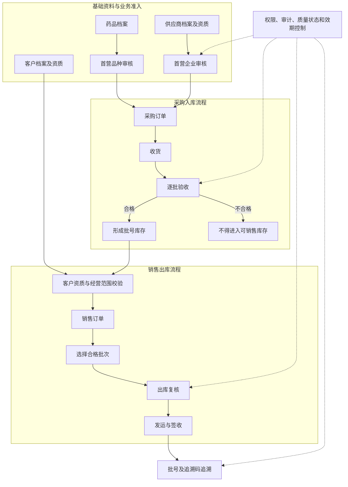
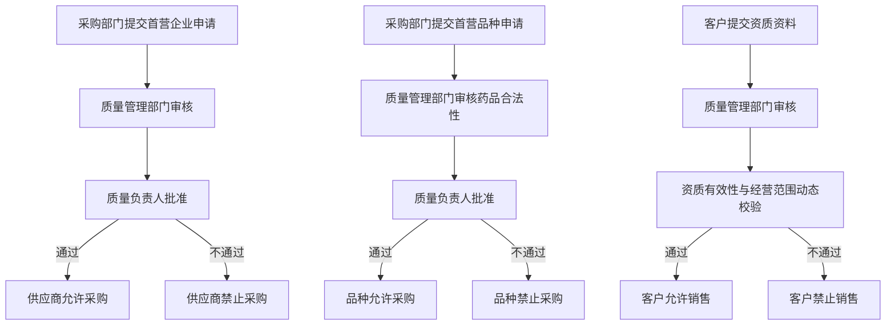
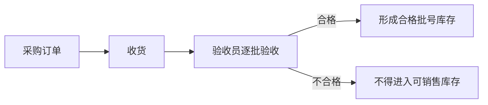
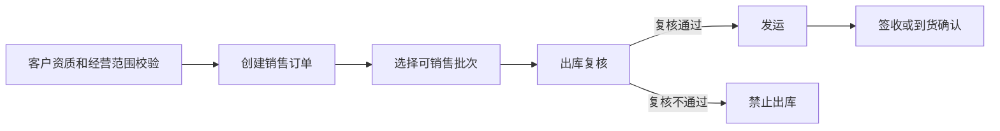
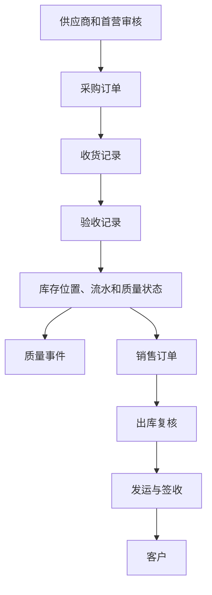
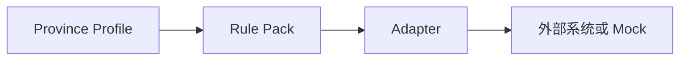

# 药品批发 ERP Demo 范围说明（DEMO_SCOPE）

> **核心定位：** 全国药品批发核心流程 + 广东业务增强展示的验证型 Demo。

| 文档属性 | 内容                                         |
| -------- | -------------------------------------------- |
| 文档版本 | v1.1                                         |
| 文档状态 | 冻结基线                                     |
| 上一版本 | v1.0                                         |
| 最后更新 | 2026-07-23                                   |
| 适用项目 | `pharma-erp-demo`                          |
| 适用阶段 | 产品、业务与技术可行性验证阶段               |
| 范围变更 | 必须遵循[第 16 章：范围变更规则](#section-16) |

> **重要说明：** 本文档已完成人工确认，并作为当前 Demo 阶段的冻结范围基线。后续任何范围变更必须遵循第 16 章规则，并同步更新文档版本、业务范围、验收标准和风险说明。

## 关键词约定

| 关键词                 | 含义                                                                             |
| ---------------------- | -------------------------------------------------------------------------------- |
| **必须**         | 首版 Demo 必须实现，属于验收范围。                                               |
| **禁止**         | 当前阶段不得采用或不得实现。                                                     |
| **首版不实现**   | 明确排除在当前 Demo 范围之外。                                                   |
| **预留**         | 仅保留数据模型、接口或扩展点，不连接真实外部系统。                               |
| **Mock**         | 使用模拟接口、模拟回执或模拟数据展示能力。                                       |
| **Profile**      | 面向特定地区或场景的配置组合，不复制核心业务系统。                               |
| **法规映射控制** | 根据公开监管要求抽取并映射到 Demo 的控制点，不等同于完整合规结论。               |
| **演示增强控制** | 为形成完整、可审计的软件闭环而增加的工程控制，不表示法规逐字要求采用该实现方式。 |

## 目录

1. [文档目的](#section-1)
2. [产品定位](#section-2)
3. [Demo 核心目标](#section-3)
4. [首版业务范围：基础档案](#section-4)
5. [准入与首营管理](#section-5)
6. [采购、收货与验收](#section-6)
7. [批号库存、库存流水与质量状态](#section-7)
8. [销售、出库复核、运输与签收](#section-8)
9. [批号与追溯码管理](#section-9)
10. [权限、审计与数据保障](#section-10)
11. [广东增强范围](#section-11)
12. [首版明确不实现](#section-12)
13. [技术原则](#section-13)
14. [AI / Codex 开发规则](#section-14)
15. [Demo 验收标准](#section-15)
16. [范围变更规则](#section-16)
17. [合规声明](#section-17)

---

<a id="section-1"></a>

## 1. 文档目的

本文档用于明确并冻结 `pharma-erp-demo` 当前阶段的产品范围，并作为以下工作的共同基线：

- 业务流程设计；
- 数据模型设计；
- 法规控制点映射；
- AI / Codex 任务拆分；
- 代码实现；
- 测试设计；
- Demo 演示与验收；
- 范围变更评审。

本项目当前目标不是开发完整、可直接商用的药品 ERP，而是开发一个：

> **全国药品批发核心流程 + 广东业务增强展示的验证型 Demo。**

### 1.1 验证目标

本 Demo 用于验证：

1. 药品批发核心业务流程能否通过软件系统实现；
2. GSP 相关关键控制点能否映射为系统功能和业务规则；
3. AI 辅助开发能否快速构建复杂行业 Demo；
4. 项目是否值得继续投入人员和资源进行商业化重构。

Demo 验证通过后，应重新开展商业系统的需求分析、合规分析、计算机系统验证和架构设计，不能直接将 Demo 等同于生产系统。

### 1.2 当前阶段的正确定位

- 验证产品方向；
- 验证业务模型；
- 验证关键质量控制点；
- 验证演示价值；
- 验证 AI 辅助开发方式。

### 1.3 当前阶段不代表

- 已通过药品监督管理部门验收；
- 已满足全部 GSP 实施要求；
- 已满足所有省级监管细则；
- 已完成企业计算机系统验证；
- 可以直接用于真实药品经营或生产环境。

---

<a id="section-2"></a>

## 2. 产品定位

### 2.1 产品名称

**全国药品批发 ERP 合规流程演示 Demo**

### 2.2 目标用户

目标用户为中国大陆小型药品批发企业。

首版企业画像如下：

| 维度     | 首版范围                                             |
| -------- | ---------------------------------------------------- |
| 法人主体 | 单法人企业                                           |
| 经营主体 | 单一经营主体                                         |
| 仓储模式 | 单一自营仓库                                         |
| 经营类型 | 普通药品批发业务                                     |
| 业务流程 | 标准药品采购、收货、验收、储存、销售、运输和追溯流程 |

### 2.3 地区策略

采用以下地区能力分层：

1. **全国统一核心规则**；
2. **广东省增强展示配置**。

| 层级       | 说明                                                       |
| ---------- | ---------------------------------------------------------- |
| 全国核心层 | 保持药品批发核心流程、核心数据模型和基础质量控制的一致性。 |
| 省级增强层 | 通过配置、规则包和适配器展示地区差异，不侵入核心业务。     |

首版支持的 Profile：

- `NATIONAL_DEFAULT`
- `GD_DEMO_PROFILE`

广东以外的其他省份（例如吉林）暂不实现，仅作为未来扩展能力的验证方向。

#### 禁止事项

- 禁止开发“广东专版 ERP”；
- 禁止将广东规则硬编码到核心业务逻辑；
- 禁止为每个省份复制一套系统；
- 禁止在业务代码中散落大量地区判断。

#### 未来扩展方式

省级差异统一通过以下扩展机制承载：

- `Province Profile`：省级配置组合；
- `Rule Pack`：省级业务规则包；
- `Adapter`：外部系统和地区接口适配器。

---

<a id="section-3"></a>

## 3. Demo 核心目标

Demo 必须能够完整演示：

> 一批药品在完成药品、供应商、客户和品种准入后，从合法供应商进入企业，经过采购、收货和验收形成批号库存，再销售并发运给合法客户，最终能够按照批号完成全过程追溯，并查询质量状态、权限控制和关键操作审计记录。

### 3.1 核心业务闭环



> 质量状态、有效期、权限、审计和追溯不是业务结束后的附加步骤，而是贯穿准入、采购、收货、验收、库存、销售、出库和运输全过程的控制能力。

### 3.2 核心成功条件

- 核心流程可以从头到尾重复演示；
- 供应商、首营品种和客户的准入规则能够阻止不符合条件的业务；
- 关键质量控制规则能够阻止不合规操作；
- 库存能够精确到药品、批号、有效期、仓库和质量状态；
- 库存数量和质量状态变化能够追踪来源；
- 销售去向能够追溯到客户、发运和签收信息；
- 关键操作能够追溯到操作人和数据变化。

---

<a id="section-4"></a>

## 4. 首版业务范围：基础档案

基础档案是后续采购、质量、库存、销售和追溯流程的前置数据。

### 4.1 药品档案

首版必须包含以下字段：

| 字段           | 要求                                         |
| -------------- | -------------------------------------------- |
| 通用名称       | 必须                                         |
| 商品名称       | 如有则记录，不作为所有药品的必填字段         |
| 剂型           | 必须                                         |
| 规格           | 必须                                         |
| 批准文号       | 必须                                         |
| 生产企业       | 必须                                         |
| 储存条件       | 必须                                         |
| 有效期管理规则 | 必须，定义效期控制方式                       |
| 近效期预警阈值 | 必须支持配置，可使用系统默认值               |
| 追溯管理模式   | 必须，支持`BATCH_ONLY` 和 `CODE_ENABLED` |

#### 药品档案与批次数据边界

以下内容属于具体批次数据，不应作为药品档案中的固定值：

- 生产批号；
- 生产日期；
- 有效期至；
- 当前库存数量；
- 当前质量状态；
- 具体追溯码。

上述数据应保存在收货记录、验收记录、批号库存和追溯码明细中。

追溯管理模式定义：

- `BATCH_ONLY`：实现批号级追溯，不启用追溯码扫描和码级校验；
- `CODE_ENABLED`：在批号级追溯基础上，启用追溯码扫描、校验、状态记录和 Mock 上传。

> 所有药品经营业务至少必须支持批号级追溯。追溯管理模式只决定是否启用码级功能，不表示某类药品可以完全不追溯。

### 4.2 供应商档案

首版必须包含以下信息：

| 字段           | 要求                               |
| -------------- | ---------------------------------- |
| 企业名称       | 必须                               |
| 许可证信息     | 必须                               |
| 许可证有效期限 | 必须                               |
| 生产或经营范围 | 必须，用于采购范围校验             |
| 资质附件       | 必须支持上传或模拟附件记录         |
| 首营企业状态   | 必须能够识别是否允许采购           |
| 资质状态       | 必须能够识别有效、失效、冻结等状态 |

### 4.3 客户档案

首版必须包含以下信息：

| 字段                   | 要求                       |
| ---------------------- | -------------------------- |
| 企业名称               | 必须                       |
| 经营或使用资质         | 必须                       |
| 资质有效期限           | 必须                       |
| 生产、经营或诊疗范围   | 必须，用于销售范围校验     |
| 采购人员或提货人员信息 | 首版至少支持记录和模拟核验 |
| 资质状态               | 必须能够识别是否允许销售   |

---

<a id="section-5"></a>

## 5. 准入与首营管理

首版必须支持：

1. 首营企业审核；
2. 首营品种审核；
3. 客户资质审核和动态有效性校验。

### 5.1 业务流程



### 5.2 核心规则

- 未审核通过或资质失效的供应商不得采购；
- 未审核通过的首营品种不得采购；
- 未完成合法采购、验收并形成合格库存的药品不得销售；
- 资质失效或生产、经营、诊疗范围不匹配的客户不得销售；
- 供应商和客户资质发生变化时，必须更新审核状态并重新执行动态校验；
- 首营企业和首营品种审核结果必须记录申请人、审核人、批准人、时间和意见；
- 客户资质审核必须记录审核人、审核时间、有效期和适用范围；
- 采购人员不得代替质量管理人员完成首营审核；
- 销售人员不得自行绕过客户资质校验。

---

<a id="section-6"></a>

## 6. 采购、收货与验收

### 6.1 业务流程



### 6.2 核心规则

> **采购订单不能直接增加库存。只有完成收货并经验收合格后，才能形成合格库存。**

- 采购订单必须关联已通过首营审核且资质有效的供应商；
- 首营品种必须审核通过后才允许采购；
- 采购药品不得超出供应商的生产或经营范围；
- 收货记录必须来源于采购订单；
- 收货员应核对运输方式、随货同行信息和采购记录；
- 验收必须针对实际收货记录逐批执行；
- 验收员不得修改采购订单核心业务数据；
- 验收合格后才能形成对应批号库存；
- 验收不合格的药品不得进入可销售库存；
- 收货数量、验收数量和入库数量必须能够核对。

### 6.3 验收记录字段

| 字段         | 要求                 |
| ------------ | -------------------- |
| 药品         | 必须                 |
| 批准文号     | 必须                 |
| 批号         | 必须                 |
| 生产日期     | 必须                 |
| 有效期至     | 必须                 |
| 生产企业     | 必须                 |
| 供应商       | 必须                 |
| 到货数量     | 必须                 |
| 验收合格数量 | 必须                 |
| 验收结果     | 必须                 |
| 验收员       | 必须                 |
| 验收时间     | 必须                 |
| 不合格事项   | 验收不合格时必须填写 |
| 处置措施     | 验收不合格时必须填写 |

---

<a id="section-7"></a>

## 7. 批号库存、库存流水与质量状态

### 7.1 库存模型

库存必须至少按照以下维度管理：

| 维度     | 说明                                   |
| -------- | -------------------------------------- |
| 药品     | 对应药品档案                           |
| 批号     | 区分同一药品的不同生产批次             |
| 有效期至 | 支持近效期预警、过期判断和销售拦截     |
| 仓库     | 首版为单仓，但数据模型必须保留仓库维度 |
| 库位     | 首版可简化，但必须能够表达库存位置     |
| 质量状态 | 决定库存能否销售或出库                 |
| 数量     | 记录对应批号和状态下的库存数量         |

禁止将库存简化为：

```text
药品名称 + 总数量
```

### 7.2 库存质量状态

首版至少支持以下状态：

| 状态   | 含义                         | 是否允许销售 |
| ------ | ---------------------------- | ------------ |
| 待验   | 已收货，尚未完成验收         | 否           |
| 合格   | 验收合格且未被其他规则限制   | 是           |
| 冻结   | 暂停使用，等待质量确认或处置 | 否           |
| 不合格 | 已判定不符合要求             | 否           |

### 7.3 销售拦截规则

以下库存禁止销售：

- 待验库存；
- 冻结库存；
- 不合格库存；
- 已超过有效期的库存；
- 数量不足的库存；
- 存在未关闭质量事件且规则要求锁定的库存。

### 7.4 库存流水

每次库存数量发生变化，必须生成库存流水。

质量状态发生变化时，必须生成质量状态变更记录；如果系统采用按质量状态分层的库存模型，状态变化还应形成对应的状态转出和转入流水。

库存流水至少记录：

- 药品；
- 批号；
- 仓库和库位；
- 变动前数量；
- 变动数量；
- 变动后数量；
- 变动前质量状态；
- 变动后质量状态；
- 变动原因；
- 来源单据类型和编号；
- 操作人；
- 操作时间。

禁止直接修改库存总数量而不生成库存流水和审计记录。

> 库存流水是为了保证数据真实、完整、可追溯而采用的软件实现方式，属于本 Demo 的演示增强控制。

### 7.5 效期和质量异常控制

系统必须支持：

- 按药品档案中的阈值进行近效期预警；
- 超过有效期后自动锁定并禁止销售和出库；
- 创建最小质量事件；
- 根据质量事件冻结指定批号库存；
- 冻结时记录原因、发起人、操作时间和关联业务；
- 冻结后禁止销售和出库；
- 质量管理员对质量事件进行调查、确认并提出处置意见；
- 质量负责人批准冻结库存转为合格或不合格；
- 状态变更必须记录处理意见、处理人、处理时间及修改前后状态；
- 所有质量事件和状态变更均可审计、可查询。

首版不实现完整的：

- 药品召回业务闭环；
- 不合格药品销毁流程；
- CAPA 管理；
- 质量事故上报平台对接。

---

<a id="section-8"></a>

## 8. 销售、出库复核、运输与签收

### 8.1 业务流程



### 8.2 销售前检查

| 检查项         | 检查内容                     | 不通过时的处理       |
| -------------- | ---------------------------- | -------------------- |
| 客户合法性     | 客户资质是否有效             | 禁止销售             |
| 客户经营范围   | 是否允许采购对应类别药品     | 禁止销售             |
| 采购或提货人员 | 身份或授权信息是否有效       | 禁止销售或转人工确认 |
| 药品状态       | 药品档案是否有效             | 禁止销售             |
| 库存质量状态   | 是否为合格、可销售库存       | 禁止销售             |
| 有效期         | 是否过期或不满足企业销售规则 | 禁止销售             |
| 库存数量       | 可用数量是否满足订单需求     | 禁止提交或调整数量   |

### 8.3 出库复核规则

- 出库必须经过独立的复核步骤；
- 未复核或复核不通过，不得完成销售出库；
- 复核记录必须保留复核员、复核时间和复核结果；
- 实际出库药品、批号、有效期和数量必须与销售记录一致；
- 已过期、冻结、不合格或存在其他异常的药品不得出库；
- 复核发现异常时必须停止出库并通知质量管理人员处理。

### 8.4 简化运输与签收记录

首版必须记录：

- 发运时间；
- 发货地址；
- 收货单位；
- 收货地址；
- 运输单号或货单号；
- 药品件数；
- 运输方式；
- 承运单位（委托运输时）；
- 运输车辆信息（需要演示时）；
- 签收人或到货确认人；
- 签收或到货确认时间；
- 异常说明。

本功能只用于完成药品流向和追溯闭环，不实现真实：

- TMS；
- GPS 定位；
- 车辆调度；
- 路线规划；
- 承运商结算；
- 物流平台对接。

> 国家 GSP 对运输质量控制和委托运输记录有明确要求；签收人、签收时间和到货确认作为本 Demo 的追溯闭环增强字段实现。

---

<a id="section-9"></a>

## 9. 批号与追溯码管理

### 9.1 批号级追溯

全国核心层必须完整实现**批号级追溯**。

用户输入药品批号，例如：

```text
A20260701
```

系统必须能够查询并串联以下信息：



### 9.2 追溯码数据模型

首版数据模型必须能够表达：

- 追溯码；
- 药品；
- 批号；
- 当前追溯状态；
- 入库业务记录；
- 出库业务记录；
- 扫码时间；
- 扫码人；
- 上游或下游追溯信息校验结果；
- Mock 上传状态和回执。

### 9.3 全国默认 Profile 的码级范围

`NATIONAL_DEFAULT` 首版必须：

- 支持追溯码数据模型；
- 支持使用模拟数据录入和查询追溯码；
- 支持批号与追溯码的关联；
- 保证未启用码级功能时仍可完成批号级追溯。

### 9.4 广东 Demo Profile 的码级闭环

`GD_DEMO_PROFILE` 首版必须使用 Mock 方式演示：

1. 入库时扫描或录入追溯码；
2. 校验药品、数量和上游追溯信息是否一致；
3. 对重复码、数量不一致或药品不一致进行拦截；
4. 销售出库时扫描追溯码；
5. 生成提供给下游的追溯信息；
6. 生成模拟上传请求、成功或失败状态和回执记录；
7. 保留扫码、校验和 Mock 上传审计记录。

完整采购退货、销售退回、重新验收和库存回退流程不属于首版范围。

首版不实现：

- 真实国家药品追溯平台上传；
- 真实广东监管平台上传；
- 真实第三方药品信息化追溯系统对接；
- 真实医保追溯码接口；
- 真实监管账号认证和数据交换。

---

<a id="section-10"></a>

## 10. 权限、审计与数据保障

### 10.1 基础角色

首版必须支持以下角色：

| 角色       | 主要职责                                                                 |
| ---------- | ------------------------------------------------------------------------ |
| 系统管理员 | 用户、角色、基础配置和系统维护                                           |
| 采购员     | 创建和维护采购业务数据，提交首营申请                                     |
| 收货员     | 核对到货、运输和随货信息，创建收货记录                                   |
| 验收员     | 根据收货记录逐批执行药品验收并记录结论                                   |
| 质量管理员 | 审核首营资料、审核客户资质、调查质量事件并提出处置意见                   |
| 质量负责人 | 对首营企业和首营品种作最终批准；对重大质量状态处置和关键质量决定进行审批 |
| 仓库管理员 | 库存、库位、发货和仓储业务操作                                           |
| 销售员     | 客户选择、资质校验和销售订单处理                                         |
| 出库复核员 | 对出库药品、批号、数量和质量状态进行复核                                 |

> 真实企业中岗位能否兼任，应结合企业实际组织机构、人员资质和岗位制度确认。Demo 采用角色分离，主要用于清晰展示不相容职责和权限控制。

### 10.2 权限原则

权限必须按照岗位职责进行分离。

| 角色       | 允许操作                                                   | 禁止操作                             |
| ---------- | ---------------------------------------------------------- | ------------------------------------ |
| 采购员     | 创建采购订单、提交首营申请                                 | 执行收货、验收、修改验收结论         |
| 收货员     | 创建收货记录、核对到货信息                                 | 执行质量验收、修改采购订单核心数据   |
| 验收员     | 逐批验收、填写验收结论                                     | 修改采购订单、批准首营、审批质量异常 |
| 质量管理员 | 审核首营资料、审核客户资质、调查质量事件、提出质量处置意见 | 最终批准自己提交或审核的首营事项     |
| 质量负责人 | 批准或驳回首营企业和首营品种；批准重大质量处置             | 修改采购订单、执行收货、验收和销售   |
| 销售员     | 创建销售订单、执行客户准入校验                             | 修改库存质量状态、执行出库复核       |
| 出库复核员 | 执行出库复核                                               | 修改原销售订单核心数据、修改质量状态 |

Demo 必须能够直观演示：

```text
采购员不能收货
收货员不能验收
验收员不能修改采购订单
销售员不能修改库存质量状态
质量管理员负责资料审核、质量调查和处置建议
质量管理员不能代替质量负责人完成最终首营批准
质量负责人负责首营最终批准和重大质量处置审批
```

### 10.3 审计要求

关键操作必须记录：

- 操作人；
- 操作时间；
- 操作类型；
- 操作对象；
- 操作内容；
- 修改原因；
- 修改前数据；
- 修改后数据；
- 业务关联编号；
- 请求或操作来源。

审计记录必须可查询，不得由普通业务角色随意修改或删除。

### 10.4 简化数据备份展示

首版必须支持：

- 每日备份计划配置；
- 备份执行记录；
- 备份开始和结束时间；
- 备份成功或失败状态；
- 失败原因；
- 备份文件或备份位置标识；
- 至少完成一次演示数据库恢复测试；
- 保存恢复测试时间、执行人、数据范围和结果记录。

数据保留要求：

- 数据模型和系统配置必须能够体现记录类数据保存期限不少于 5 年；
- Demo 不通过实际运行 5 年验证该能力；
- 删除、归档或清理策略不得破坏审计和追溯关系。

首版不建设：

- 生产级高可用集群；
- 异地容灾中心；
- 自动故障切换；
- 完整灾难恢复平台；
- 大规模备份存储管理系统。

> 按日备份和记录保存期限属于法规映射控制；恢复测试用于证明备份具有可恢复性，属于本 Demo 的演示增强控制。

---

<a id="section-11"></a>

## 11. 广东增强范围

广东作为首版 Demo 的省级增强展示 Profile，使用：

```text
GD_DEMO_PROFILE
```

### 11.1 首版包含

- 广东业务配置；
- 广东规则展示；
- 广东追溯码级流程 Mock；
- 入库追溯码校验；
- 重复码和不一致信息拦截；
- 出库追溯码采集；
- 追溯数据 Mock 上传和回执记录；
- 简化运输与签收展示；
- 监管接口 Mock；
- 广东扩展字段预留；
- 省级能力启用与关闭的演示。

### 11.2 首版不包含

- 真实广东监管系统接入；
- 真实第三方追溯平台接入；
- 真实监管接口报文承诺；
- 真实监管账号；
- 真实数据上传；
- 对真实监管平台可用性或合规性的承诺。

### 11.3 广东规则适用边界

- 广东省规则通过 `GD_DEMO_PROFILE`、`Rule Pack` 和 `Adapter` 展示；
- 广东储存运输专项规定存在具体适用对象和条件，Demo 不将其全部要求错误地表述为所有全国药品批发企业的统一要求；
- 广东当前追溯要求发生变化时，应更新 Profile 和 Mock 规则，不得修改全国核心业务模型；
- 国家要求高于或更新于地方配置时，应以国家现行要求为准。

### 11.4 未来扩展方向

- 多仓协同；
- 委托储存和委托运输；
- 更多现代医药物流能力；
- 真实广东地区外部监管和追溯接口适配。

上述未来能力不属于当前 Demo 验收范围。

---

<a id="section-12"></a>

## 12. 首版明确不实现

以下内容明确排除在当前 Demo 范围之外。

### 12.1 特殊管理或高风险业务

- 麻醉药品；
- 第一类精神药品；
- 第二类精神药品；
- 医疗用毒性药品；
- 放射性药品；
- 疫苗。

### 12.2 高复杂度物流与硬件

- 自动化立体仓库；
- 完整 WMS；
- WCS；
- TMS；
- PLC 设备连接；
- GPS 实时定位；
- 真实车辆调度；
- 温湿度硬件实时接入。

> 简化的发运、运输和签收记录属于当前范围，不因排除 TMS 而取消。

### 12.3 外部系统与真实接口

- 真实省级监管接口；
- 国家药品追溯平台真实上传；
- 第三方药品信息化追溯平台真实对接；
- 医保追溯码真实接口；
- 财务系统对接；
- ERP 财务模块。

### 12.4 复杂企业场景

- 多法人；
- 多租户；
- 多省完整规则；
- 零售门店；
- 医院业务；
- SaaS 平台。

### 12.5 完整质量管理扩展

- 完整药品召回；
- 完整销毁流程；
- CAPA；
- 偏差管理体系；
- 质量事故外部上报；
- 不良反应管理系统。

> 上述排除项不得因“顺便实现”“代码不多”或“以后可能需要”等理由进入当前开发任务。

---

<a id="section-13"></a>

## 13. 技术原则

### 13.1 总体架构

采用：

> **模块化单体（Modular Monolith）**

当前阶段不采用：

- 微服务；
- 分布式架构；
- 复杂消息中间件；
- 为高并发场景提前设计的复杂基础设施。

原因：当前阶段的首要目标是验证**业务模型、法规控制点和业务闭环是否正确**，不是验证高并发和大规模分布式能力。

### 13.2 建议模块

| 模块                    | 主要职责                                             |
| ----------------------- | ---------------------------------------------------- |
| `master-data`         | 药品、供应商、客户和资质基础档案                     |
| `quality`             | 首营审核、客户资质审核、验收、质量事件和质量状态控制 |
| `purchase`            | 采购订单和采购业务流程                               |
| `inventory`           | 批号库存、库存流水、库位、效期和状态转移             |
| `sales`               | 销售订单、批次选择、出库复核、发运和签收             |
| `traceability`        | 批号级追溯、追溯码管理和 Mock 上传记录               |
| `audit-security`      | 用户、角色、权限、审计日志和备份执行审计             |
| `province-profile`    | 省级 Profile 和规则启用配置                          |
| `integration-adapter` | 外部监管、追溯或第三方系统适配器及 Mock              |

### 13.3 省级扩展原则

禁止在核心业务中散落类似以下判断：

```java
if (province == GD) {
    // 广东专属业务逻辑
}
```

统一采用以下扩展结构：



核心要求：

- 全国核心业务不依赖具体省份；
- 省级规则可独立启用、关闭或替换；
- 外部接口通过适配器隔离；
- 省级扩展不得破坏全国核心流程；
- Profile 只选择规则，不直接承载大量业务代码。

### 13.4 首版实现限制

首版不得建设：

- 通用规则引擎；
- 可视化规则编辑器；
- 动态脚本平台；
- 自定义表达式语言；
- 面向任意省份的通用政策配置平台。

首版中的 `Rule Pack` 只允许通过少量、明确、已经确认的配置项和策略类实现，用于隔离：

- `NATIONAL_DEFAULT`
- `GD_DEMO_PROFILE`

之间的已确认差异。

不得为了未来可能支持其他省份而提前建设复杂规则平台。

---

<a id="section-14"></a>

## 14. AI / Codex 开发规则

### 14.1 Goal 拆分原则

每个 Goal 只能完成一个明确、可测试、可演示的业务闭环。

禁止：

- 一个 Goal 同时开发多个大型模块；
- 在未确认业务流程前直接生成大量代码；
- 未经范围确认增加新业务；
- 为未来需求进行过度设计；
- 用技术完成度代替业务闭环完成度；
- 因修改一个控制点而顺便重构无关模块。

### 14.2 每个 Goal 的强制输出

每个 Goal 完成后必须输出：

| 序号 | 输出项       | 最低要求                         |
| ---- | ------------ | -------------------------------- |
| 1    | 修改文件     | 列出新增、修改和删除的文件       |
| 2    | 数据模型变化 | 说明表、字段、枚举和约束变化     |
| 3    | 业务流程变化 | 说明新增或改变的业务步骤和规则   |
| 4    | 测试场景     | 包含正常、异常、权限和审计场景   |
| 5    | 演示步骤     | 提供可重复执行的操作步骤         |
| 6    | 风险         | 说明已知限制、遗留问题和潜在影响 |

### 14.3 标准开发顺序


不得跳过范围、流程、控制点或数据模型确认，直接进入大规模代码实现。

---

<a id="section-15"></a>

## 15. Demo 验收标准

Demo 完成时，至少必须满足以下验收项。

| 验收编号 | 验收维度   | 验收标准                                                                                                         |
| -------- | ---------- | ---------------------------------------------------------------------------------------------------------------- |
| AC-01    | 核心业务   | 能够完整演示“准入 → 采购 → 收货 → 验收 → 库存 → 销售 → 出库复核 → 发运签收 → 追溯”闭环。               |
| AC-02    | 质量控制   | 能够演示待验、合格、冻结和不合格库存，并能阻止不可销售库存进入销售和出库流程。                                   |
| AC-03    | 权限控制   | 不同角色只能执行其职责范围内的操作，采购、收货、验收、质量审核和出库复核等不相容职责能够分离。                   |
| AC-04    | 审计追踪   | 能够查询谁在什么时间对什么数据进行了什么修改，并查看修改原因和修改前后内容。                                     |
| AC-05    | 演示数据   | 能够初始化或重置演示数据，并重复执行核心演示流程。                                                               |
| AC-06    | 批号追溯   | 输入批号后，能够查询供应商、首营、采购、收货、验收、库存、质量事件、销售、出库、运输签收和客户信息。             |
| AC-07    | 广东增强   | 启用`GD_DEMO_PROFILE` 后，能够演示追溯码入出库扫码、重复码或不一致拦截、Mock 上传和回执，但不连接真实平台。    |
| AC-08    | 准入与首营 | 未通过首营企业、首营品种或客户资质审核时，系统能够阻止采购或销售。                                               |
| AC-09    | 库存与效期 | 数量变化能够生成库存流水；近效期能够预警；过期库存能够自动锁定并禁止销售。                                       |
| AC-10    | 质量事件   | 能够创建质量事件、冻结批号库存，由质量管理员提出处置意见，并由质量负责人批准转为合格或不合格，完整保留审计记录。 |
| AC-11    | 运输签收   | 能够记录发运、运输和签收或到货确认信息，并在追溯结果中查询。                                                     |
| AC-12    | 备份恢复   | 能够查询每日备份计划和执行记录，并完成至少一次演示数据库恢复测试。                                               |

### 15.1 核心业务验收路径

```text
供应商和首营企业审核
  ↓
首营品种审核
  ↓
采购
  ↓
收货
  ↓
验收
  ↓
批号库存与库存流水
  ↓
客户资质校验
  ↓
销售
  ↓
出库复核
  ↓
发运与签收
  ↓
批号及追溯码追溯
```

### 15.2 关键异常验收场景

至少应稳定复现：

- 供应商首营未通过时禁止采购；
- 首营品种未通过时禁止采购；
- 客户资质失效或经营范围不匹配时禁止销售；
- 待验、冻结、不合格和过期库存禁止销售；
- 收货员尝试执行验收时被拒绝；
- 验收员尝试修改采购订单时被拒绝；
- 出库复核不通过时禁止发运；
- 追溯码重复或与药品不一致时禁止入库；
- 备份失败时形成失败记录；
- 质量状态变更时保留完整审计记录。

### 15.3 可重复演示要求

- 演示数据可以初始化或重置；
- 演示步骤有固定脚本或说明；
- 正常流程可以重复执行；
- 关键异常拦截可以稳定复现；
- 每次演示结果可核对、可追踪；
- Mock 外部服务可以稳定返回预设成功和失败结果。

### 15.4 分阶段验收顺序

本文档中的验收项全部属于首版范围，但必须分阶段完成，不允许在一个 Goal 中同时实现全部验收项。

#### M1：全国核心业务闭环

优先完成：

- AC-01 核心业务；
- AC-02 质量状态拦截；
- AC-03 权限控制；
- AC-04 审计追踪；
- AC-05 演示数据；
- AC-06 批号追溯；
- AC-08 准入与首营；
- AC-09 库存与效期。

M1 完成后，系统应能够在不启用广东增强功能的情况下，完整演示全国核心批号级业务闭环。

#### M2：广东增强与质量展示

在 M1 通过后完成：

- AC-07 广东追溯码 Mock；
- AC-10 质量事件；
- AC-11 运输签收。

M2 不得修改或绕过 M1 已经冻结的核心业务规则。

#### M3：演示加固

最后完成：

- AC-12 备份恢复；
- 全流程重复演示；
- 演示数据重置；
- Mock 成功和失败场景；
- 演示脚本和固定账号；
- 最终演示截图和问题清单。

任何里程碑未通过验收，不得提前宣布后续里程碑完成。

---

<a id="section-16"></a>

## 16. 范围变更规则

任何新增功能在进入开发前，必须回答以下问题：

1. 是否属于药品批发核心流程？
2. 是否直接服务当前 Demo 的演示目标？
3. 是否会改变当前业务模型或关键规则？
4. 是否会增加新的合规责任或风险？
5. 是否需要修改本文档及其验收标准？

### 16.1 变更决策原则

仅当新增内容对当前 Demo 的核心业务闭环、法规控制点展示或演示价值具有明确必要性时，才可以考虑纳入。

未经明确确认，不得增加：

- 新业务模块；
- 新省份规则；
- 新外部真实接口；
- 新复杂技术组件；
- 新企业经营场景；
- 当前范围外的特殊管理药品。

### 16.2 变更后的最低动作

范围变更获得确认后，至少必须同步更新：

- 本文档版本号、状态和更新时间；
- 受影响的业务范围；
- 数据模型；
- 角色和权限；
- 验收标准；
- 开发计划；
- 风险说明。

### 16.3 冻结条件

本文档只有在同时满足以下条件后，才能将状态改为“冻结基线”：

1. 产品范围已经人工确认；
2. 核心流程图已经人工确认；
3. 角色和权限边界已经人工确认；
4. 数据模型范围已经人工确认；
5. 验收项已经人工确认；
6. 文档已提交 Git 并形成可追踪版本。

---

<a id="section-17"></a>

## 17. 合规声明

本 Demo 依据公开的药品经营质量管理要求设计核心业务流程，目标是展示药品批发 ERP 中的准入、采购、收货、验收、储存、效期控制、销售、出库复核、运输、追溯、权限、审计和数据备份等关键控制思想。

本文档中的控制分为：

1. **法规映射控制**：根据公开法规、规章和监管文件提取的业务控制点；
2. **演示增强控制**：为使软件流程完整、可测试、可审计而采用的工程实现，例如库存流水、签收字段和恢复测试。

本 Demo 不代表：

- 药品监督管理部门认证或认可的系统；
- 已通过 GSP 检查或计算机系统验证的系统；
- 已完整满足国家、地方及企业全部监管要求的系统；
- 已完成真实药品信息化追溯平台接入的系统；
- 可直接部署到真实药品经营环境的商业生产系统。

正式商业化或投入真实经营前，必须结合以下内容重新设计、验证和确认：

- 企业实际经营范围；
- 企业组织机构和岗位职责；
- 人员资质及岗位兼任条件；
- 企业质量管理体系与 SOP；
- 仓库、设施设备和运输条件；
- 国家及所在地届时现行监管要求；
- 真实外部系统接口和追溯标准；
- 数据安全、备份、权限、审计和计算机系统验证要求；
- 企业实际的数据保留和灾难恢复策略。

> 本文档是产品和软件工程范围说明，不构成法律意见、监管验收结论或合规承诺。

---

## 参考资料

以下资料作为 Demo 范围设计和控制点映射的公开依据，不能替代企业正式合规评估：

1. [国家药品监督管理局：《药品经营质量管理规范》修改决定](https://www.nmpa.gov.cn/yaopin/ypfgwj/ypfgbmgzh/20160720093001180.html)
2. [福建省药品监督管理局：现行《药品经营质量管理规范》全文](https://yjj.scjgj.fujian.gov.cn/zwgk/flfggz/gz/202606/t20260608_7160663.htm)
3. [司法部：《药品经营和使用质量监督管理办法》](https://www.moj.gov.cn/pub/sfbgw/flfggz/flfggzbmgz/202401/t20240108_492998.html)
4. [国家药品监督管理局：《中华人民共和国药品管理法》](https://www.nmpa.gov.cn/xxgk/fgwj/flxzhfg/20190827083801685.html)
5. [广东省药品监督管理局：《广东省药品监督管理局药品批发企业储存运输管理若干规定》](https://mpa.gd.gov.cn/xwdt/tzgg/content/post_4192000.html)
6. [广东省药品监督管理局：《广东省全面推进药品经营使用环节全品种信息化追溯工作方案》](https://mpa.gd.gov.cn/zwgk/gzwj/content/post_4810637.html)

---

**文档结束**
